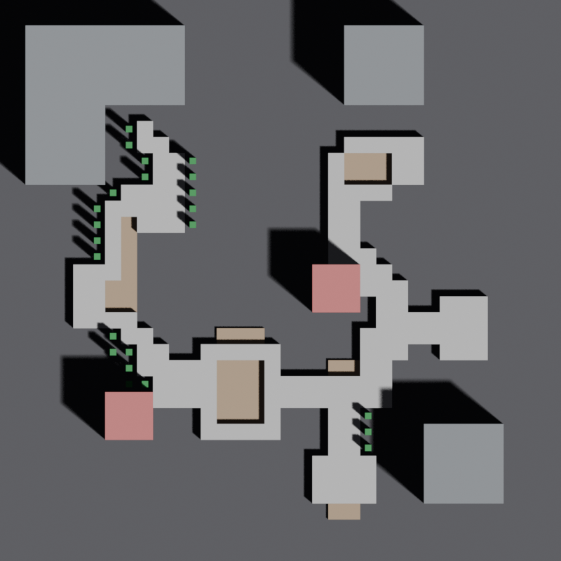

# Modular Tilemap Editor

언리얼/블렌더 모듈러 레벨 디자인을 위한 **640×640 그리드** 타일맵 에디터 (v0.4).
2D로 그린 그림을 JSON으로 저장 → Blender 스크립트가 3D 큐브로 자동 조립합니다.

**🌐 Live Demo (브라우저에서 즉시 사용)**: https://hyesunjeong.github.io/modular-tilemap-editor/

설치·다운로드 없이 위 URL에서 바로 그리기 시작. JSON 저장 후 Blender 단계는 아래 가이드 참고.

> **v0.4 변경점**
> - 그리드 **128×128 → 640×640** (총 640m × 640m, 25배 면적)
> - **영토(TER) 레이어** 신설 — Material 4색(노랑/빨강/파랑/회색) + SubLevel
> - **사냥터 공간(ZON_Hunt_Area)** — 10×10 검정/흰 체커, 그룹화·이동 가능
> - **도로(ROD)** — 대로(8×8) / 소로(4×4)
> - 환경/건물 모두 1×1로 통일 + **브러시 최대 100×100** + 프리셋 버튼
> - **그룹화 시스템** — 선택 도구로 사냥터 공간 묶어 함께 이동
> - **localStorage 자동 저장** — 3초 throttle, 새로고침해도 복원
> - **F2**로 영역 이름 변경 + **40px** 큰 라벨
> - 패닝(스페이스+드래그), 도구 단축키(1/2/3/4), 영토 잠금(🔒)
> - PC **이동속도 4.2 m/s (420 cm/sec)** 기준 path ETA 계산



## 개요

모듈러 블럭(영토 마커, 잔디·흙·돌·물, 자연물, 건물, 도로, 사냥터 공간)을
2D 타일맵 형태로 그리고, Blender Python 스크립트로 3D 씬에 자동 배치합니다.

**워크플로우**:

```
[index.html에서 그리기]
        ↓ JSON 저장
[examples/*.json]
        ↓ Blender Python 실행
[3D 목업 씬]
```

## 빠른 시작

### 1. 에디터 열기
`index.html` 더블클릭. 의존성 없음, 인터넷 불필요.

### 2. 타일맵 그리기

- 좌측 팔레트에서 모듈 선택 (레이어별 그룹화)
- **좌클릭** 칠하기 / 드래그로 영역 페인트
- **우클릭** 지우개 (선택한 모듈의 레이어만 지움)
- 멀티셀 모듈(영토·도로)은 클릭 한 번에 영역 차지
- 굵은 그리드선이 **63칸마다** 표시 (Material 단위 정렬)

파일을 창에 드래그하면 자동 처리:
- `.json` → 맵 로드 (v1/구버전 ID 자동 마이그레이션)
- `.png` / `.jpg` → 밑그림 참조 이미지 로드 (모든 모듈 위에 오버레이)

### 도구 & 단축키

| 단축키 | 동작 |
|---|---|
| `1` | **펜** 도구 |
| `2` | **지우개** 도구 |
| `3` | **측정** 도구 (사각/원/경로 모드 + 영역 저장) |
| `4` | **선택** 도구 (사냥터 공간 그룹화·이동 전용) |
| `Space` + 드래그 | 화면 이동 (패닝) |
| 마우스 휠 | 줌 인/아웃 (15% ~ 400%) |
| `0` | 줌 100% 리셋 |
| `[` / `]` | 브러시 크기 -1 / +1 |
| `Ctrl+Z` / `Ctrl+Y` | 되돌리기 / 다시 실행 |
| `Ctrl+G` | 그룹 토글 (선택 있으면 그룹화 / 없으면 hover 그룹 해제) |
| `F2` | 선택된 영역(annotation) 이름 변경 |

브러시 프리셋 버튼: **1 / 10 / 20 / 30 / 50 / 100**

### 3. 영토 잠금
영토 위에 잔디/흙/사냥터 공간을 그릴 때, 영토가 실수로 지워지지 않도록
좌측 팔레트의 **영토 (TER)** 헤더에서 **🔒 / 🔓 토글** 가능.
잠금 ON이면 지우개가 영토 레이어를 무시 (페인트는 가능).

### 4. 사냥터 공간 그룹화

1. **선택(4)** 도구 활성
2. 드래그로 사각 영역 선택 — 사냥터 공간이 **완전히 영역 안에 들어갔을 때만** 선택됨 (10×10 단위)
3. `Ctrl+G` → 그룹화 (그룹마다 다른 색 외곽선)
4. 그룹된 사냥터 공간 위 클릭+드래그 → **그룹 전체가 함께 이동** (10셀 단위 스냅)
5. 그룹된 셀 위에 hover + `Ctrl+G` → 그룹 해제

### 5. 측정 도구

`3`으로 진입 후 우측 패널에서 모드 선택:
- 🟦 **사각** — 영역 면적·치수 (몬스터존, 보스존)
- ⭕ **원** — 반경·둘레·면적 (NPC 시선, 스킬 범위)
- 📍 **경로** — 점 클릭 누적, 총 거리 + **이동시간** (4.2 m/s PC 기준)
- ✋ **이동** — 저장된 영역 선택 후 드래그로 이동

라벨 입력 후 **영역 저장** → 캔버스에 **40px 큰 라벨 + 색깔 박스**로 표시.
이동 모드에서 영역 선택 후 `F2` → 라벨 변경.

### 6. 자동 저장

- 마지막 변경 **3초 후 자동 저장** (브라우저 localStorage)
- 상태바에 `💾 자동 저장됨 HH:MM:SS` 표시
- 페이지 새로고침/크래시 후 다음 접속 시 **복원 다이얼로그** 표시
- 중요한 단계마다 **수동 JSON 저장**(다운로드) 백업 권장 (브라우저 캐시가 지워져도 파일은 남음)

### 7. PNG 밑그림 (Underlay)

언리얼 엔진의 네비게이션 영역을 스크린샷으로 캡쳐 → PNG 저장 →
에디터의 **이미지 불러오기** 또는 드래그-앤-드롭으로 로드.
**모든 모듈 위에 오버레이**되며 투명도 슬라이더(0~100%)로 조절.

### 8. Blender에서 조립

1. Blender 실행 (4.x 권장)
2. **Scripting** 탭 → 새 스크립트 → `blender_scripts/assemble_mockup.py` 내용 붙여넣기
3. 스크립트 상단의 `JSON_PATH` 변수를 본인 JSON 경로로 수정
   ```python
   JSON_PATH = r"C:\path\to\your\tilemap.json"
   ```
4. `Alt+P` 로 실행

→ 색상 큐브로 3D 목업 자동 생성. 탑다운 ortho 카메라 + 광원 자동 셋업.
F12로 렌더 가능.

## 파일 구조

```
.
├── index.html                       # 에디터 (단일 파일, 의존성 없음)
├── examples/                        # 샘플 JSON (구버전, 자동 마이그레이션됨)
├── blender_scripts/
│   └── assemble_mockup.py           # JSON → Blender 큐브 조립
├── docs/                            # 미리보기 이미지
├── README.md
├── LICENSE
└── .gitignore
```

## JSON 포맷 (v2)

```json
{
  "version": 2,
  "size": [640, 640],
  "tile_size_m": 1.0,
  "coord_system": {"origin": "top-left", "x_axis": "right", "y_axis": "down", "z_axis": "up"},
  "modules_legend": [...],
  "placements": [
    {"module": "TRN_Base_Grass", "x": 0, "y": 0, "z": 0, "footprint": [1,1], "yaw": 0, "groupId": null}
  ],
  "annotations": [...]
}
```

- 좌표: 이미지 기준 (좌상단 (0,0), x→오른쪽, y→아래)
- `z`는 높이 레이어 인덱스 (생략시 0)
- `groupId`: 사냥터 공간 그룹 ID (null이 아닌 경우 그룹 소속)
- Blender 변환 시 y축이 반전되어 월드 +Y(북쪽) = 타일맵 위쪽으로 매핑

**자동 마이그레이션**: `block_1m_*`, `tree`, `building_3x3`, `ENV_Tree_Pine`,
`BLD_House_Generic`, `TER_Material` 등 구 ID가 새 ID로 자동 변환.

## 모듈 라이브러리 (v0.4)

레이어 기반 prefix:

| ID | Layer | Footprint | 색 | 용도 |
|---|---|---|---|---|
| `TER_Material_Yellow` | territory | 63×63 | 연/진 노랑 체커 | 영토 (스냅 63) |
| `TER_Material_Red`    | territory | 63×63 | 연/진 빨강 체커 | 영토 |
| `TER_Material_Blue`   | territory | 63×63 | 연/진 파랑 체커 | 영토 |
| `TER_Material_Gray`   | territory | 63×63 | 회색 체커       | 영토 |
| `TER_SubLevel`        | territory | 126×126 | 청회색       | 큰 영토 단위 |
| `TRN_Base_Grass`      | base      | 1×1 | 초록      | 잔디 |
| `TRN_Base_Dirt`       | base      | 1×1 | 갈색      | 흙 |
| `TRN_Base_Stone`      | base      | 1×1 | 회색      | 돌바닥 |
| `TRN_Base_Water`      | base      | 1×1 | 청록      | 얕은 물 |
| `ENV_Nature_01`       | environment | 1×1 | 녹       | 자연물 01 |
| `ENV_Nature_02`       | environment | 1×1 | 회       | 자연물 02 |
| `BLD_House_01`        | environment | 1×1 | 분홍       | 건물 01 |
| `BLD_House_02`        | environment | 1×1 | 연분홍     | 건물 02 |
| `BLD_House_03`        | environment | 1×1 | 보라       | 건물 03 |
| `ROD_Main`            | road      | 8×8 | 흰         | 대로 |
| `ROD_Sub`             | road      | 4×4 | 회         | 소로 |
| `ZON_Hunt_Area`       | zone      | 10×10 | 검/흰 체커 | 사냥터 공간 (스냅 10, 그룹화 가능) |

### 레이어 스택 (아래 → 위)

```
territory → base → elevation → environment → road → zone
```

- **territory**: 영토 마커 (지면 아래, 잠금 가능)
- **base**: 지형 (잔디/흙/돌/물)
- **elevation**: (현재 비어있음, 향후 단차/슬로프용)
- **environment**: 자연물/건물
- **road**: 도로
- **zone**: 사냥터 공간 (모든 것 위)

### 모듈 추가/변경

세 곳을 동기화:

1. `index.html` 의 `MODULES` 배열 (색·이름·footprint·layer·snap·pattern)
2. `blender_scripts/assemble_mockup.py` 의 `MODULE_STYLE` (3D 높이·색)
3. 새 카테고리 prefix는 Blender의 `get_module_layer()` + `LAYER_Z_OFFSET`에도 추가

## 디자인 의도

**왜 큐브로 시작하는가**: 진짜 모듈 메쉬를 바로 쓰면 결과가 이상할 때
"좌표 버그인지, 모듈 자체 문제인지" 분간이 안 됩니다. 단순 색상 큐브로
먼저 데이터 파이프라인(JSON 파싱 → 좌표 변환 → 배치)을 격리해서 검증한 뒤,
나중에 한 줄만 바꿔 실제 모듈 라이브러리로 교체하는 흐름입니다.

```python
# 지금: 큐브 생성
mesh = make_cube_mesh(...)

# 나중에: 라이브러리에서 진짜 모듈 가져오기
mesh = append_from_library("modules.blend", "SM_Tree_Pine_A")
```

## 로드맵

- [x] v0.1 — MVP 32×32 에디터 + 절차적 큐브 검증
- [x] v0.2 — 128×128 / 사분면 그리드선 / PNG 밑그림 / 레이어 / z 필드
- [x] v0.3 — 줌 + 측정 시스템 + annotation 저장/이동
- [x] **v0.4** — 640×640 / 영토·도로·사냥터 레이어 / 그룹화 / 자동 저장 / 성능 최적화
- [ ] v0.5 — 실제 Blender 모듈 라이브러리 연결 (큐브 → 실제 SM 메쉬)
- [ ] 모듈 썸네일 자동 생성 (Blender 일괄 렌더)
- [ ] Unreal Engine 임포트 파이프라인 (FBX 일괄 익스포트)
- [ ] 랜덤 yaw / 변형 시드

## 라이선스

MIT — see [LICENSE](LICENSE)
